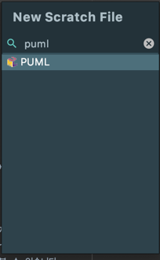

::: tip 이 글은
다이어그램을 마우스가 아닌 코드로 작성하는 환경에 대해 알아봅니다.  
UML 작성 환경: OSX Catalina, Intellij Ultimate 2019.3  
:::

## UML이란?

[위키 피디아](https://ko.wikipedia.org/wiki/%ED%86%B5%ED%95%A9_%EB%AA%A8%EB%8D%B8%EB%A7%81_%EC%96%B8%EC%96%B4)에서는 UML을 이렇게 정의하고 있습니다.
> 통합 모델링 언어(Unified Modeling Language)  
> 소프트웨어 집약 시스템을 개발할 때 산출물을 명세화, 시각화, 문서화할 때 사용한다.

### 산출물은 이미 우리 곁에
저희는 이미 산출물을 접하고 있습니다.  
가장 많이 접하는 산출물은 UI 정의서(기획서)일 것입니다.  
UI 정의서는 기획자를 통해서 PPT 형태로 작성되는 것이 보편적일 것입니다.  
그리고 대개(~~저라고 말 못합니다.~~) UI 정의서가 나오고 나면 개발을 시작합니다.  
더 정확히 말하면 코드 작성을 시작합니다.

### 산출물은 이미 있는데 굳이?
왜?  
귀찮게!!~~개발자는 코드로 말한다.~~  
코드 작성하기도 바쁜데 UML을 작성해야 할까요?

UI 정의서만 가지고 개발을 진행하다보면 UI 정의서에서 요구사항에 대해 누락되었거나,
논리적으로 맞지 않는 부분이 나오게 될 수 있습니다.  
개발전에 UI 정의서 검토를 하였겠지만 개발 중 발견되는 경우가 분명 있을 수 있습니다.  
문제는 개발이 이미 많이 진행되었고, 프로젝트 일정또한 빠듯하다는 것입니다.

또 UI 정의서는 텍스트로 되어 있습니다.  
UI 정의서는 대개 7할 화면 정의, 3할 요구사항으로 작성이 되며
요구사항에 많은 내용이 담길 경우 폰트 크기를 줄이면서까지 한 페이지에 표시 하려 할 수 있습니다.  
이런 부분이 요구사항에 대한 이해도를 저하시켜 구현을 다르게 혹은 누락시키는 결과를 가져올 수 있습니다.

이렇듯 UI 정의서는 개발자가 이해하기에는 부족한 부분이 있을 수 있습니다.  
그렇기 때문에 개발자는 UI 정의서를 구현하기에 앞서 요구사항에 대한 검토 단계와 시각화를 통한 구체화 단계로 UML을 작성할 필요가 있습니다.

## 요구사항 분석 단계에서 UML
::: tip 참고 서적
해당 내용은 [Software Requirements 3](https://wikibook.co.kr/software-requirements-3rd/)을 참고하였습니다.
:::

## [PlantUML](https://plantuml.com/ko/)
[PlantUML](https://plantuml.com/ko/)은 코드로 다양한 UML을 작성하게 해주는 오픈소스입니다.  
시쿼스, 유스케이스, 클래스 다이어그램 등 다양한 다이어그램을 지원하고 있습니다.  
syntax가 어렵지 않고 많은 툴에서 지원을 하고 있습니다.  
지금 이 글을 작성중인 마크다운에서도 PlantUML을 작성할 수 있는 라이브러리가 존재합니다.

@startuml
start
:마크다운에서도;
:UML 작성이;
:가능 합니다.;
end
@enduml

### Intellij IDEA에서 PlantUML 작성해보기
> OS X 환경, [Homebrew](https://brew.sh/index_ko)가 설치되어 있다는 가정하에 진행됩니다.  
> [Homebrew](https://brew.sh/index_ko)가 설치되어 있지 않다면 사이트에 설명을 참고하여 설치해주세요.

- 설치
    1. 커맨드 환경에서 `brew install plantuml` 타이핑하여 설치
        - 이 부분이 진행되지 않으면 Intellij Idea에서 미리보기를 지원하지 못합니다.
    2. Intellij IDEA -> 환경설정 -> plugins -> PlantUML integration 플러그인 검색하여 설치
    3. 설치를 완료하게되면 File - New - `PlantUML File`이 생긴것을 볼 수 있습니다.  
        
    4. stretch file 목록에서도 확인 가능합니다.  
        
- 작성해보기

