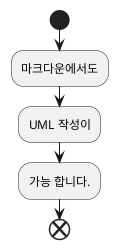
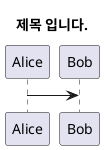
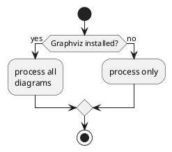
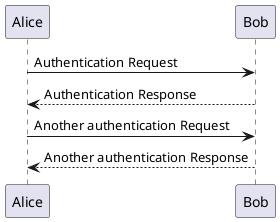
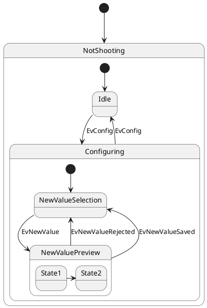
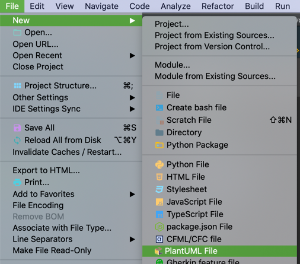
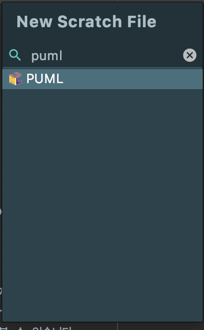
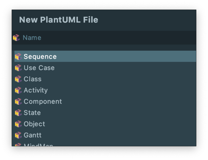
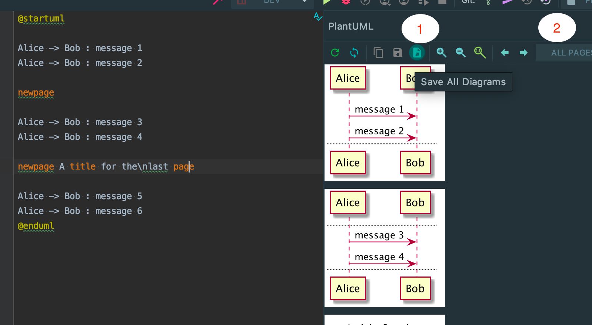
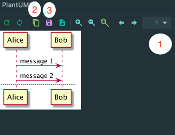

> 다이어그램을 UI 툴이 아닌 코드로 작성하는 환경에 대해 알아봅니다.  
> 해당 글은
> [소프트웨어 요구사항 3](https://wikibook.co.kr/software-requirements-3rd/)을
> 참고하였습니다.  
> 문서 작성 환경: OSX Catalina, Intellij Ultimate 2019.3


## 개발 전 요구사항 시각화하기

::: tip 소프트웨어 요구사항 3 - 요구사항 모델 만들기
시각적인 요구사항 모델은 **누락되거나 관련 없는**, 혹은 **모순된 요구사항**을 식별하는 데 이바지 할 수 있다.  
...  
15번째 요구사항을 확인하는 동안 **처음 몇 개**의 요구사항은 **이미 잊어버렸을 것**이다.  
단순히 **문자 형태**의 요구사항을 **검토**함으로써 모든 오류를 찾을 확률은 **낮다.**
:::

프로젝트에서 흔히 요구사항 정의서는 **화면 설계서(혹은 기획서)** 일 것 입니다.  
여기에는 도메인 요구사항, 시스템의 기능에 대해서 담고 있을 것이지만 개발을 위한 명세를 추가 정의할 필요가 있을 것이고, 또
책의 내용대로 기획서에 모순된 내용이 존재할 수도 있습니다.  
이런 이유로 개발자는 개발을 시작하기 전 요구사항에 대해 UML을 통해 다시 정의해 볼 필요가 있습니다.


## [PlantUML](https://plantuml.com/ko/)
중요한 UML이지만 작성하려면 번거로운 것이 사실입니다.  
많이 쓰이는 [draw.io](https://www.draw.io/) 툴로 UML을 작성하고 유지보수 한다고 생각하면 여간
번거롭지 않습니다.  
마우스라는 인터페이스의 한계가 아닐까 합니다.

[PlantUML](https://plantuml.com/ko/)은 코드로 다양한 UML을 작성하게 해주는 오픈소스입니다.  
시쿼스, 유스케이스, 클래스 다이어그램 등 다양한 다이어그램을 지원하고 있습니다.  
문법이 어렵지 않고 많은 툴에서 지원하고 있습니다.  
지금 이 글을 작성한 마크다운에서도 PlantUML을 작성할 수 있는 라이브러리가 존재합니다.

@startuml
start
:마크다운에서도;
:UML 작성이;
:가능 합니다.;
end
@enduml

이렇듯 코드로 작성이 가능하기 때문에 버전관리도 가능하게되고 유지보수에 많은 이점이 있습니다.


### 문법 살펴보기
간단하게 PlantUML의 문법에 대해서 살펴보려 합니다.

#### 1) 공통

1. 오류 화면  
   문법 error 발생 시 에러 정보에 대해서 알려주기 때문에 문서를 참고하여 수정하면 됩니다.
@startuml
:error
@enduml

2. 제목

@startuml
title 제목 입니다.
Alice -> Bob
@enduml

3. 스타일
   - 텍스트  
   Creole 엔진을 사용하여 다양한 표현 가능.  
   자세한 사항은 [문서](https://plantuml.com/ko/creole)를 참고해주세요.
   - 색상  
   요소의 색상을 직접 수정 할 수 있습니다.
    ```puml
    @startuml
    Alice -> Bob: <font color="#FF5733">색상 변경 </font>
    @enduml
    ```
    @startuml
    Alice -> Bob: <font color="blue">색상 변경 </font>
    @enduml
    - 스킨(skinparam)  
    skinparam 명령어를 사용하여 색상, 글꼴, 정렬을 일괄 지정할 수 있습니다.
    ```puml
    @startuml
    skinparam monochrome true
    Alice -> Bob
    @enduml
    ```
    @startuml
    skinparam monochrome true
    Alice -> Bob
    @enduml
4. 그 외  
  Header, Caption, 범례 등 기능등이 존재합니다.  
  자세한 사항은 [문서](https://plantuml.com/ko/commons) 참조


#### 2) Activity Diagram
로직컬한 부분에 대해서 표현해주는 Activity Diagram입니다.

@startuml

start
if (Graphviz installed?) then (yes)
  :process all\ndiagrams;
else (no)
  :process only;
endif

stop
@enduml
조건문외에도 반복문, 병렬성, 커넥터, 그룹화 등 다양한 표현을 할 수 이씁니다.  
자세한 사항은 [문서](https://plantuml.com/ko/activity-diagram-beta) 참조

#### 3) Sequence Diagram
프로세스 단계 별 수행하는 행위자 혹은 시스템을 표현합니다.

@startuml
Alice -> Bob: Authentication Request
Bob --> Alice: Authentication Response

Alice -> Bob: Another authentication Request
Alice <-- Bob: Another authentication Response
@enduml
흐름간 메시지 전달, 메시지 순서, 메시지 그룹화 등 추가적인 표현을 할 수 있습니다.  
자세한 사항은 [문서](https://plantuml.com/ko/sequence-diagram) 참조

#### 4) State Diagram
시스템의 동작에 따라 변화하는 상태를 표한합니다.

@startuml
[*] --> NotShooting

state NotShooting {
  [*] --> Idle
  Idle --> Configuring : EvConfig
  Configuring --> Idle : EvConfig
}

state Configuring {
  [*] --> NewValueSelection
  NewValueSelection --> NewValuePreview : EvNewValue
  NewValuePreview --> NewValueSelection : EvNewValueRejected
  NewValuePreview --> NewValueSelection : EvNewValueSaved

  state NewValuePreview {
	 State1 -> State2
  }

}
@enduml
이렇듯 상태에 따라 처리되는 과정을 표현할 수 있으며, 상태 내부에 상태도 표현이 가능합니다.  
이 외에도 멀티 스레드, 동시성 등을 표현할 수 있습니다.  
자세한 사항은 [문서](https://plantuml.com/en/state-diagram) 참조

이 외에도 많은 기능과 다이어그램을 제공함으로 자세한 내용은 [문서](https://plantuml.com/ko/sitemap-language-specification)를 참고 바랍니다.

### 여러 도구로 PlantUML 작성해보기
#### 1) Intellij IDEA
> OS X 환경, [Homebrew](https://brew.sh/index_ko)가 설치되어 있다는 가정하에 진행됩니다.
> [Homebrew](https://brew.sh/index_ko)가 설치되어 있지 않다면 사이트에 설명을 참고하여 설치해주세요.

- 설치
    1. 커맨드 환경에서 `brew install plantuml` 타이핑하여 설치
        - 이 부분이 진행되지 않으면 Intellij Idea에서 미리보기를 지원하지 못합니다.
    2. Intellij IDEA -> 환경설정 -> plugins -> PlantUML integration 플러그인 검색하여 설치
    3. 설치를 완료하게되면 File - New - `PlantUML File`이 생긴것을 볼 수 있습니다.
        
    4. stretch file 목록에서도 확인 가능합니다.  
        
- 작성해보기
  1. 파일명을 입력하고 다이어그램 종류를 선택합니다.  
     
  2. 작성 후 스크린샷 저장  
     Sequence Diagram을 한 파일에 세 페이지를 작성하여 보았습니다.  
     플러그인에서 가장 중요한 기능인 이미지 파일로 내보내기를 살펴보겠습니다.
     - 전체  
       
       1. 전체 페이지를 페이지 별 이미지 파일로 내보내기 하는 버튼입니다.
       2. ALL PAGES가 선택되어 있어야 합니다.
     - 페이지  
       각 페이지별 내용이 많을 경우 나눠서 불 수 있습니다.  
       
       1. ALL PAGES를 눌러 페이지를 변경합니다.
       2. 페이지의 내용을 이미지로 Clipboard에 복사합니다.
       3. 페이지의 내용을 이미지 파일로 내보냅니다.

