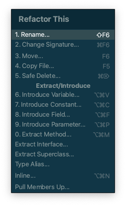

::: tip 이 글은

macOS, Intellij 2020.2.3, TypeScript 기준으로 작성되었습니다.  
Intellij에서 코드 작성을 도와주는 기능들을 살펴봅니다.

:::

## [리팩토링](https://www.jetbrains.com/help/idea/refactoring-source-code.html)

> 리팩토링은 겉으로 드러나는 코드의 기능은 바꾸지 않으면서 내부 구조를 개선하는
> 방식으로 소프트웨어 시스템을 수정하는 과정이다. 버그가 생길 가능설을 최소로
> 줄이면서 코드를 정리하는 정제된 방법이다. 요컨대, 리팩토링한다는 것은 코드를
> 작성하고 난 뒤에 설계를 개선하는 일이다. - 리팩토링 2판 들어가며 중에서

Intellij에서 리팩토링을 도와주는 살펴보겠습니다.

리팩토링을 할 코드에서 ⌘ + t를 눌러주게되면  
리팩토링

## 코드 자동 완성
## 검색
## 클립보드
## 임시 파일

