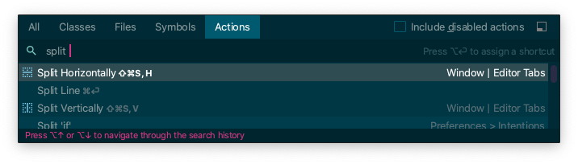

::: tip 이 글은

macOS, Intellij 2020.2.3, TypeScript 기준으로 작성되었습니다.  
Intellij에서 코드 작성을 도와주는 기능들을 살펴봅니다.

:::

## [리팩토링](https://www.jetbrains.com/help/idea/refactoring-source-code.html)

> 리팩토링은 겉으로 드러나는 코드의 기능은 바꾸지 않으면서 내부 구조를 개선하는
> 방식으로 소프트웨어 시스템을 수정하는 과정이다.  
> 버그가 생길 가능설을 최소로 줄이면서 코드를 정리하는 정제된 방법이다.  
> 요컨대,
> 리팩토링한다는 것은 코드를 작성하고 난 뒤에 설계를 개선하는 일이다. - 리팩토링
> 2판 들어가며 중에서

리팩토링을 할 코드에서 ⌃(ctrl) + T를 눌러주게되면  
메뉴로 Intellij에서 지원하는 리팩토링 기능들을 살펴볼 수 있음

rename을 동작시켜보면  
Share라는 인터페이스의 인터페이스명, 필드명을 변경하면  
참조하고 있는 파일에서도 동일하게 변경되는 것을 확인할 수 있다.

리팩토링 기능을 사용하지 않고,  
일괄 찾아 바꾸기를 할 수도 있지만 찾아 바꾸기는 불필요한 부분이 같이 바뀌거나
누락될 수도 있게 되고 원치 않게 바뀐 부분에 대한 검증을 놓치게 되면 불안정한
코드가 될 확률이 증가할 것이다.  
그렇다고 일일히 찾아서 바꾸기에는 리팩토링이라는 작업이 굉장히 귀찮은 일이
될수있다.

리팩토링 기능으로 코드 변경을 하게되면 일단 귀찮은 일이 한번에 해결이되고 변경되는
부분에 대한 안정성도 높아져 리팩토링을 쉽고 빠르게 가져갈 수 있다.

## 코드 관련

### [자동 완성](https://www.jetbrains.com/help/idea/auto-completing-code.html)

  자동완성할 위치에서 ⌃(ctrl) + space를 눌러주게 되면 작동한다.

- 프러퍼티, 메소드 등 속성 자동 완성  
  
- 후위 코드 자동 완성: 객체 생성 후 변수 선언 등, 자동 완성하고자하는 코드에서 .
  입력  
  

- HTML tag 자동 완성: tag 입력 후 tab 키 입력  
  
- 예약어 자동 완성(
  [Live templates](https://www.jetbrains.com/help/idea/using-live-templates.html))  
  
  

### [다른 의도](https://www.jetbrains.com/help/idea/intention-actions.html)

코드 상 문법, 퍼포먼스 등을 Intellij에서 분석하여 권장사항에 대해 표시하고
변경해주는 기능

## 검색

### 사용되는 곳 찾기(⌘ + B)

  메서드, 프로퍼티 등이 사용되는 코드를 찾고자 할 때 사용

### 최근 사용한 파일(⌘ + E)

  최근에 사용한 파일 목록을 보여 줌

### 전체 검색(⇧, ⇧)

  classes, 파일, 심볼, actions 전체 검색 결과를 보여주고  
  각각의 검색을 하고 싶으면 해당 탭을 클릭하거나 단축키를 입력하면된다.

## 그외
### 클립보드(⌘ + ⇧ + V)

### [임시 파일(⌘ + ⇧ + N)](https://www.jetbrains.com/help/idea/scratches.html)

  프로젝트에 포함되지 않는 임시 파일로 일부 로직 테스트 용도로 사용할 수 있다.

  

### [import 정리](https://www.jetbrains.com/help/idea/creating-and-optimizing-imports.html#optimize-imports)

사용하지 않는 import 제거하고 설정에 따라 정렬도 도와준다.

## 윈도우

### Tab Split
- 가로 / 세로 분할(⌘ + ⇧ + A -> split 검색)

  Redux 등의 상태 라이브러리를 사용하게 되어 참조해야 할 파일이 많을 경우 유용,
  단축키를 지정하여 사용하게 되면 더 빠르게 사용 가능

  

### View Mode Distraction-free(⌘ + ⇧ + A -> Distraction-free 검색)

Intellij 화면내에서는 많은 정보를 보여주는 이점이 있으나 오히려 코드 작성에
집중하고 싶을 때 그런 정보 & 텍스트 등이 거슬릴 경우가 있을 수 있는데, 이를
위해서 Intellij에서는 Distraction-free라는 view mode를 제공하고 있다.  
Distraction-free 사용하면 코드 외에 다른 정보가 숨겨져 코드 작성에 집중하고
싶을 때 추천한다.  
Distraction-free 적용 시 모든 메뉴가 감춰지기 때문에 다른 기능의 실행은 단축키
혹은 액션 검색(⌘ + ⇧ + A)으로 실행해야 한다.

- Distraction-free 적용 전
  

- Distraction-free 적용 후
  
