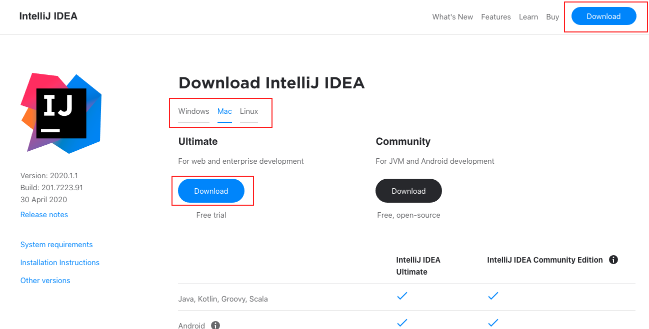
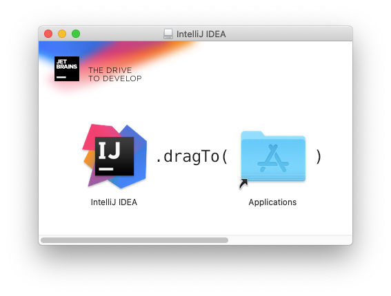
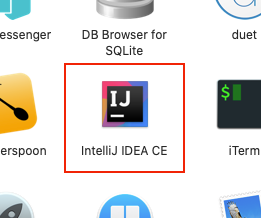
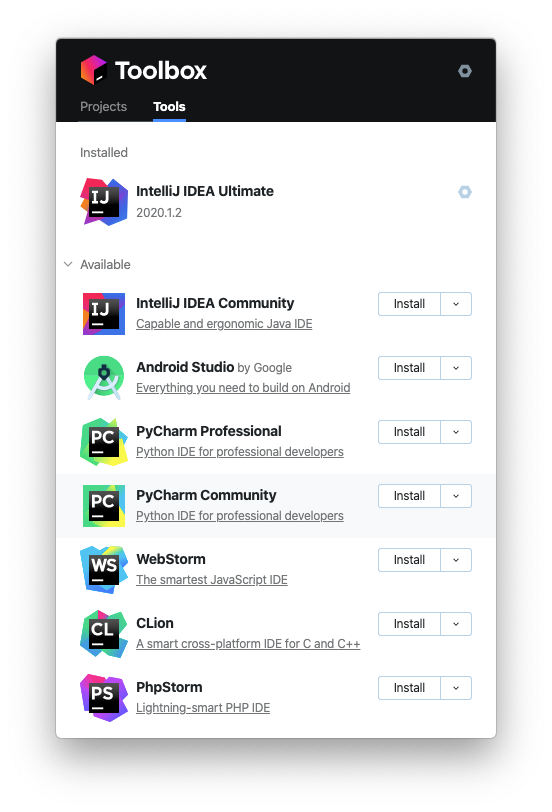
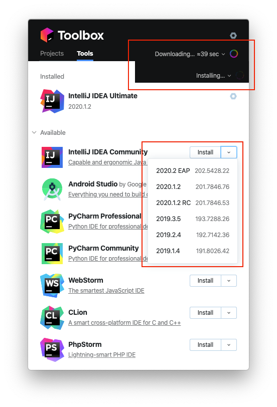
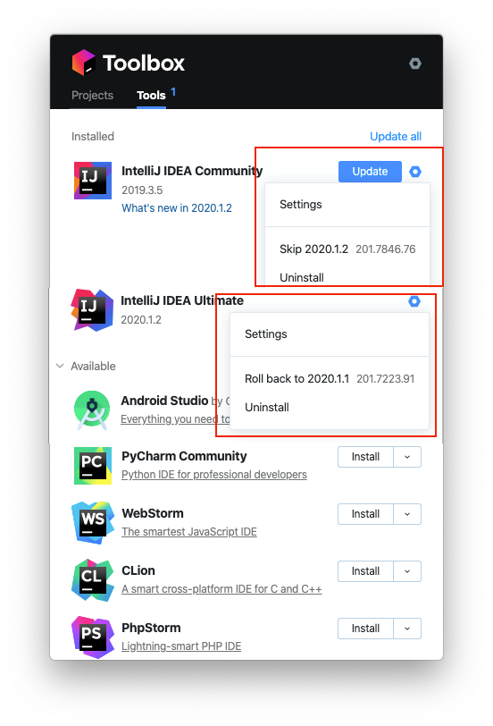
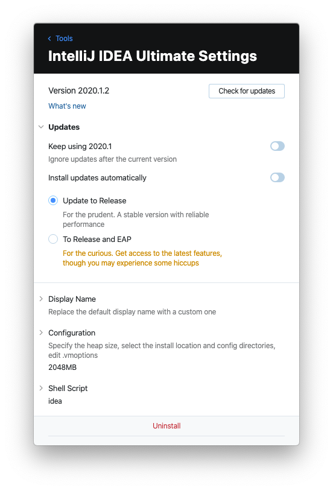
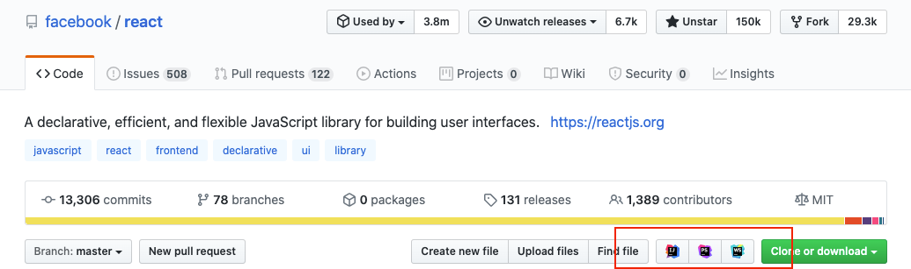

::: tip 이 글은  
macOS, Intellij 2020.1.1에서 작성되었습니다.  
Intellij 설치 및 업데이트를 macOS 기준으로 살펴봅니다.
:::

## 설치

### Intellij 다운로드 페이지에서 다운로드 설치

Intellj
[다운로드 페이지로](https://www.jetbrains.com/idea/download) 접속하여
Download를 클릭하여 설치 파일을 다운받아 설치합니다.



1. 본인의 OS를 확인
2. 자신이 사용할 Edition의 `Download` 버튼을 클릭합니다.
3. 다운된 설치 파일을 실행하여 Applications 폴더로 Intellij IDEA 파일을
   `드래그`해서 설치합니다.

---

### Homebrew cask 사용하여 설치
> [Homebrew](https://brew.sh/)가 설치되어 있다고 가정합니다.  
> [Homebrew cask](https://github.com/Homebrew/homebrew-cask)는 바이너리로
> 배포된 프로그램을 관리해주는 관리 툴입니다.  
> 위의 홈페이지에서 다운로드 설치 과정을 brew를 통해서 자동화해놓은 것입니다.

먼저 brew에서 Intellij를 검색해 봅시다.  
Casks 하위에
[intellij-idea](https://github.com/Homebrew/homebrew-cask/blob/master/Casks/intellij-idea.rb)와
[intellij-idea-ce](https://github.com/Homebrew/homebrew-cask/blob/master/Casks/intellij-idea-ce.rb)가
검색이 됩니다.

```bash
brew search intellij
...
==> Casks
intellij-idea ✔  intellij-idea-ce
```
`intellij-idea`는 Ultimate, `intellij-idea-ce`는 Community Edition입니다.

본인이 사용할 Edition을 설치해 줍니다.  
저는 `Ultimate`가 설치되어 있어 `Community Edition`를 설치해보았습니다.
```bash
brew cask install intellij-idea-ce
...
==> Downloading https://download.jetbrains.com/idea/ideaIC-2020.1.1.dmg
==> Downloading from https://download-cf.jetbrains.com/idea/ideaIC-2020.1.1.dmg
######################################################################## 100.0%
==> Verifying SHA-256 checksum for Cask 'intellij-idea-ce'.
==> Installing Cask intellij-idea-ce
==> Moving App 'IntelliJ IDEA CE.app' to '/Applications/IntelliJ IDEA CE.app'.
🍺  intellij-idea-ce was successfully installed!
```

명령어 한 번으로 다운로드 후 설치까지 `자동`으로 진행되었습니다.



## Toolbox App 사용
> Toolbox App은 Jetbrains 프로그램들의 설치, 업데이트, 롤백 등을 간편하게 할 수 있도록
> 나온 프로그램입니다.  
> 이하 `Toolbox`라고 지칭

위에서 설치 방법들에 대해서 살펴보았지만 brew를 사용하더라도 설치 후 특정 버전 업데이트 혹은
롤백등은 여전히 불편합니다.  
Jetbrains에서는 Toobox를 통해 설치, 버전 업데이트, 롤백등을 편하게 관리할 수 있도록
지원하고 있습니다.  
그러면 Toolbox가 어떤 기능을 가졌는지 살펴보겠습니다.


### 설치
[Toolbox 페이지](https://www.jetbrains.com/toolbox-app/)에서 다운 및 설치해줍니다.

::: details brew로 설치
```bash
# brew에서 jetbrains 패키지 검색
brew search jetbrains
==> Casks
jetbrains-toolbox ....

# 검색된 toolbox 설치
brew cask install jetbrains-toolbox   
==> Downloading https://download.jetbrains.com/toolbox/jetbrains-toolbox-1.17.7018.dmg
==> Verifying SHA-256 checksum for Cask 'jetbrains-toolbox'.
==> Installing Cask jetbrains-toolbox
==> Moving App 'JetBrains Toolbox.app' to '/Applications/JetBrains Toolbox.app'.
🍺  jetbrains-toolbox was successfully installed!

```
:::

### 메뉴 구성


> Toolbox를 설치 후 실행한 화면 입니다.

- 먼저 상단에 Projects, Tools로 탭이 존재하고,  
  Projects는 툴로 열수있는 프로젝트 목록,  
  Tools에서는 설치 가능한 Jetbrains 툴 목록이 존재합니다.
- Tools 탭의 목록에서 툴의 우측 `install` 버튼을 클릭하게 되면 `lataest` release
  버전이 설치되고  
  `▽` 버튼을 클릭하면 버전을 선택하여 설치할 수 있습니다.

### 필요한 툴 설치



- 설치 할 툴의 `install` 혹은 `▽` 클릭하여 버전을 선택하게 되면 상단 상태 메시지가
  표시되면서 자동으로 설치가 진행된다.
- 설치가 완료되면 `installed` 목록에 자동으로 추가되고 실행이 가능해진다.
- 설치된 Tool을 클릭하면 실행이 가능하다.

### 버전 변경 & 삭제


- 업데이트
  - 업데이트가 가능한 Tool에서는 `Update` 버튼이 자동으로 나타나게되고 클릭하면 자동으로
    업데이트 설치가 진행됨
  - 톱니바퀴를 클릭하면 해당 버전을 `Skip`하는 옵션이 존재하여 필요시 해당 버전을 설치하지
    않고 넘어갈 수 있음
- 롤백
  - 설치가 완료된 Tool을 톱니바퀴 버튼을 클릭하면 `Roll back to ...` 버튼이 존재하고
    클릭하면 자동으로 업데이트된 버전을 삭제하고 이전 버전으로 롤백을 진행
- 삭제
  - `Uninstall` 클릭 시 Tool 삭제


- 버전 고정 및 자동 업데이트
  - Tool 톱니바퀴 버튼 -> Settings 클릭하여 설정화면으로 진입
  - 더 이상 업데이트를 사용하지 않을 거라면 `Keep using ...` 활성화
  - 자동 업데이트를 사용하려면 `Install updates automatically` 활성화
    - 여기에서 정식 릴리즈 버전만을 자동 업데이트 할 것인지 EAP 버전도 업데이트 할 것인지
      선택

### 그 외 기능

#### Github Repository clone
Github에서 오픈소스의 코드를 확인하기 용이하지만 여전히 IDEA 툴에 비하면 부족합니다.  
결국 로컬에 clone하여 VSCode 혹은 Intellij 등으로 확인을 하게되는데요.  
Toolbox를 통해 조금 더 빠르게 clone 후 Intellij로 확인 할 수 있는 방법을 지원하고
있습니다.

크롬 확장 프로그램에서
[JetBrains Toolbox Extension](https://chrome.google.com/webstore/detail/jetbrains-toolbox-extensi/offnedcbhjldheanlbojaefbfbllddna)
를 설치합니다.

설치 후 Repository를 열게되면 아래와 같이 특정 tool로 clone 후 열수 있도록 아이콘이
생성된 걸 확인할 수 있습니다.  
Intellij 아이콘을 클릭하면 자동으로 Intellij clone 기능을 통해 clone 후 Intelij로
프로젝트가 실행됩니다.


