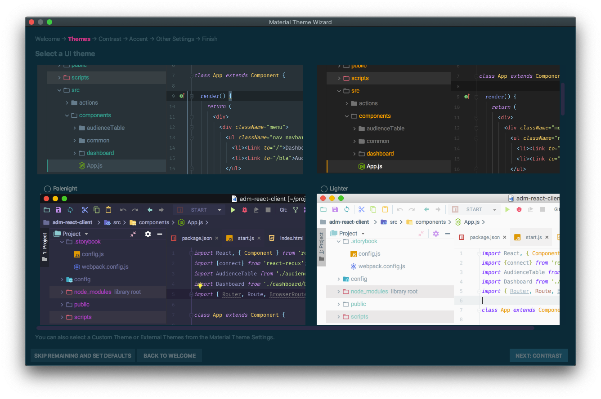
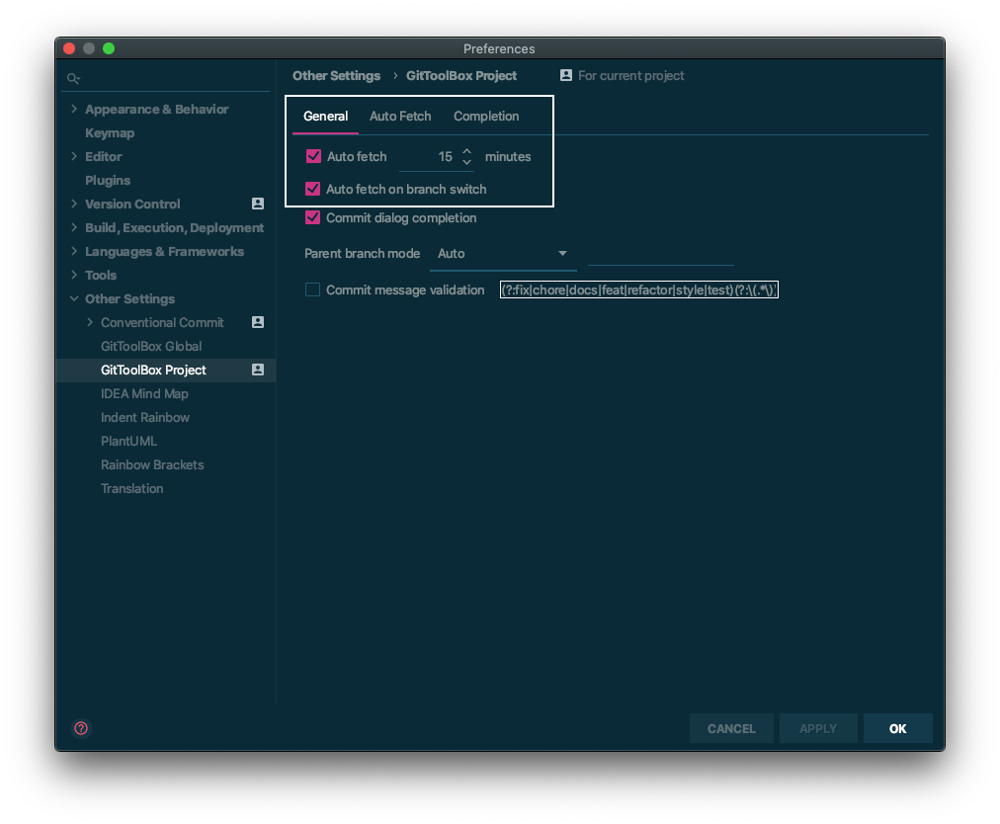
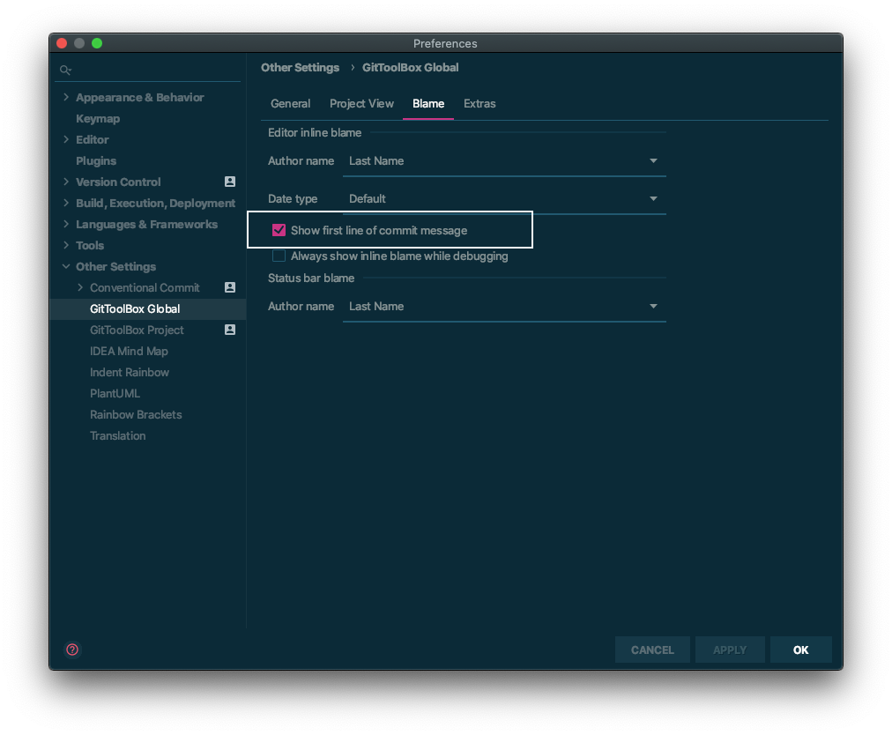
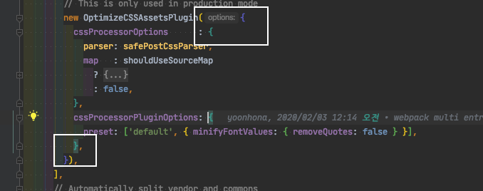
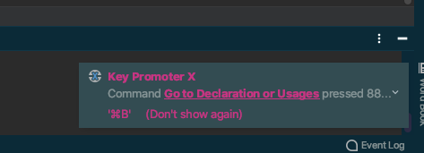
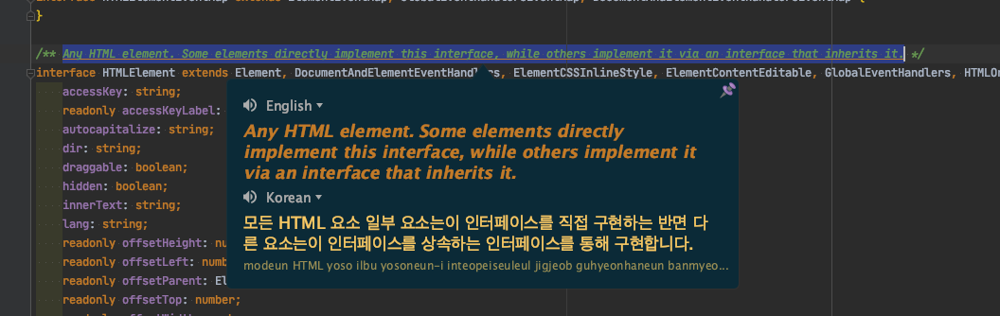
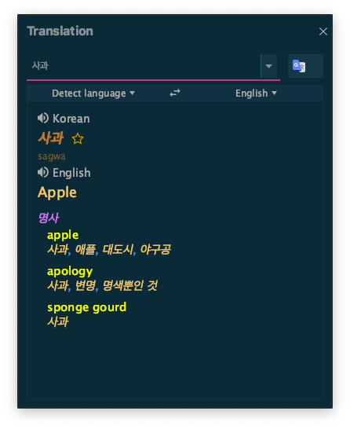
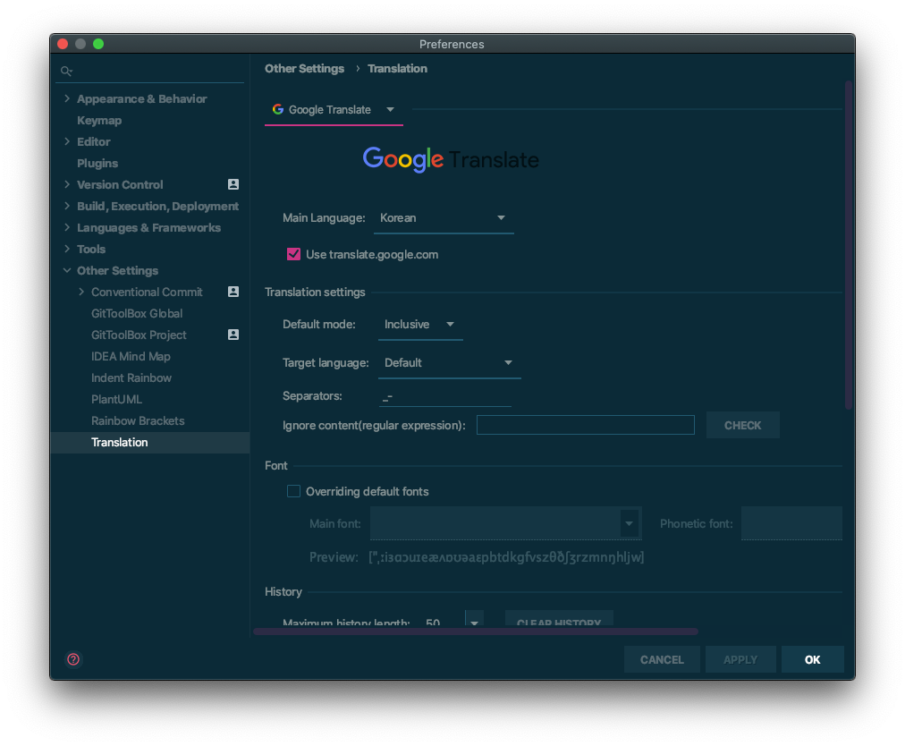

## [Material Theme UI](https://plugins.jetbrains.com/plugin/8006-material-theme-ui)

Intellij 자체 테마도 좋지만, Material Theme UI 플러그인을 설치하면 정말 많은
테마를 선택하여 적용이 가능하다.

## [GitToolBox](https://plugins.jetbrains.com/plugin/7499-gittoolbox)

Intellij에서 Git에 관련된 조금 더 편한 기능을 지원해주는 플러그인이다.  
기능을 살펴보면,

###  자동 fetch
fetch는 원격 서버의 이력을 가지고 오는 기능으로  
개발 중 이력 확인 등을 할 때 수동으로 fetch를 안 해도 되기 때문에 번거로움을
없애주는 편한 기능이다.  
시간 주기와 브랜치 변경 시에도 fetch가 실행되도록 하는 옵션 등을 추가로 설정
가능하다.

### 코드 라인 마지막 커밋 이력
개발하다 보면 한 파일의 전체 이력보다 class에서 method로, method에서
line으로 점점 작은 단위가 왜 이렇게 바뀌었는지 이해해야 할 순간이 많아진다.

Intellij의 **Git -> Show History for Selection**을 사용하면 선택한 부분의
전체 이력을 보여주어 편하긴 하지만 기능 명대로 이력을 보기 위한 기능이다.

GitToolBox에는 라인의 마지막 커밋 이력을 보여주는 옵션이 있어서  
해당 기능을 On하여 코드 작성 중 해당 라인이 왜 변경되었는지 쉽게 파악이 가능하다.

아래를 보면 블로그의 테마 적용을 위해 2019년 11월 10일에 닉네임을 수정했음을 알 수 있다.

이 외에도 커밋 메시지 자동완성 등을 지원한다.

## 들여쓰기 도우미
 [Rainbow Brackets](https://plugins.jetbrains.com/plugin/10080-rainbow-brackets), [Indent Rainbow](https://plugins.jetbrains.com/plugin/13308-indent-rainbow)

두 플러그인은 들여쓰기 된 코드를 시각화해주는 플러그인으로

먼저, Rainbow Brackets를 살펴보면 같은 블럭 시작과 끝의 색상을 다른 블럭과
구분하기 쉽게 색상을 변경하여 준다.

Indent Rainbow는 indent 레벨에 따라 여백 색상을 변경하여 주어 들여쓰기가 얼마나
되었는지 한눈에 파악하기 쉽게 해준다.

## [Key Promoter X](https://plugins.jetbrains.com/plugin/9792-key-promoter-x)

마우스로 사용한 기능의 단축키를 알려주는 플러그인

우리는 코드를 작성하는 직업이다.  
그러면 코드를 작성하는 손을 최대한 키보드에서 떨어지지 않는 게 능률을 높이는데 더
좋지 않을까?  
그러기 위해서는 단축키를 적절히 사용해야 하는데 Key Promoter X 플러그인을
설치하면 Intellij에서 자주 사용하는 기능의 단축키를 쉽게 익힐 수 있다.  
설치 후 마우스로 작업을 하다 보면 우측 하단에 뜨는 단축키 안내를 볼 수 있다.

## [Translation](https://plugins.jetbrains.com/plugin/8579-translation)

Intellij 내에서 번역을 해주는 플러그인

지금 개발에 사용되는 언어, 프레임워크들은 영어권에서 개발되었고, 문서도 영어,
주석도 영어이다.  
창피하지만 영어에는 자신이 없는데 더 똑똑한 구글 번역기에 물어보자.

크게 두 가지 기능이 있다.

1. 선택된 문장 해석  
   번역하려는 문장을 선택 후 단축키(osx 기준: cmd + ctrl + u)를 클릭하면
   툴팁으로 선택된 문장의 번역 결과를 보여준다.
   
2. 번역 창  
   단어, 문장등을 입력하면 언어에 맞게 번역 결과를 보여준다.  
   

기본은 번역 사이트는 구글 번역이지만 바이두 등 추가적인 설정이 가능하다.

